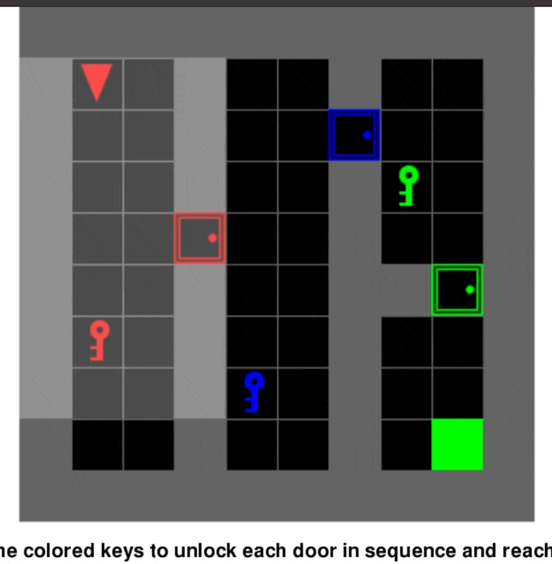
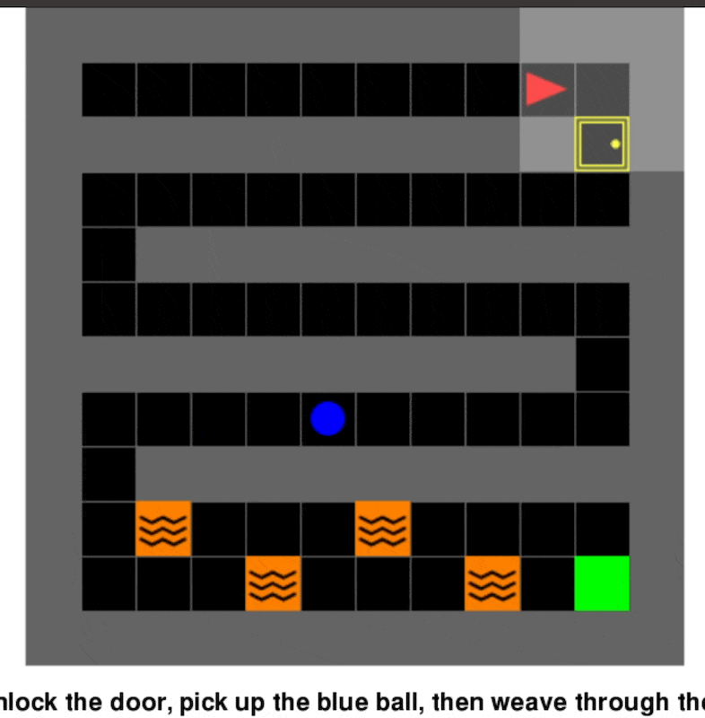
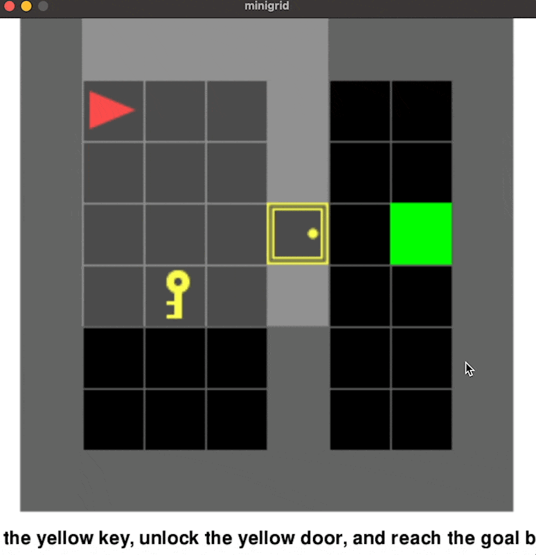
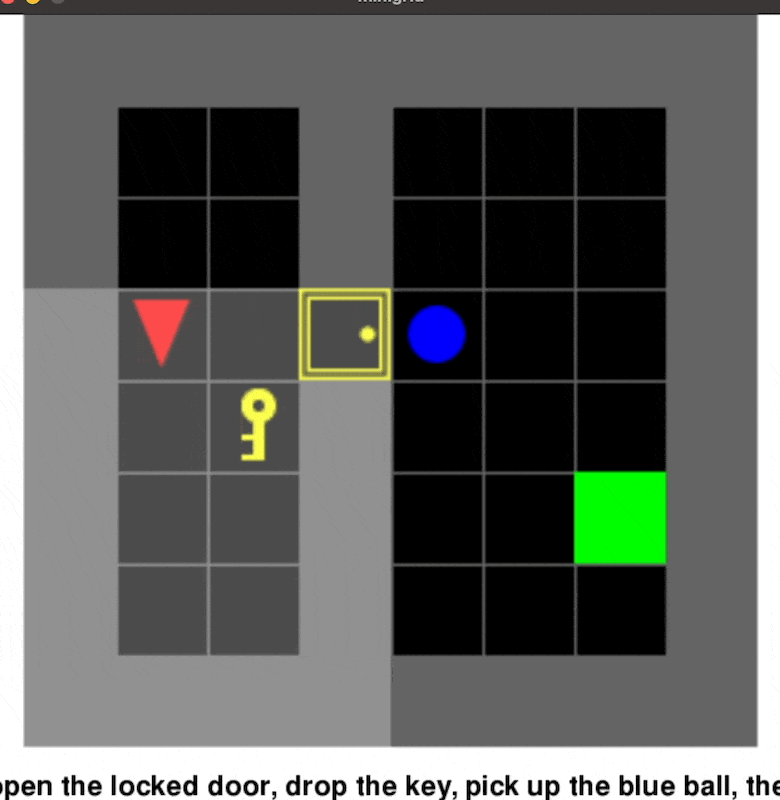
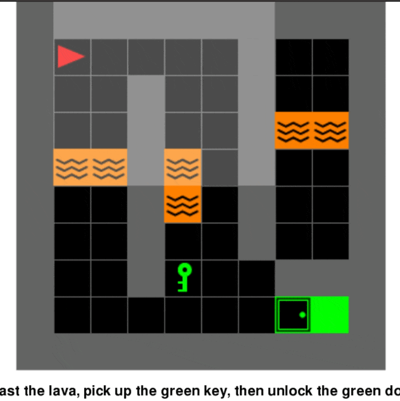
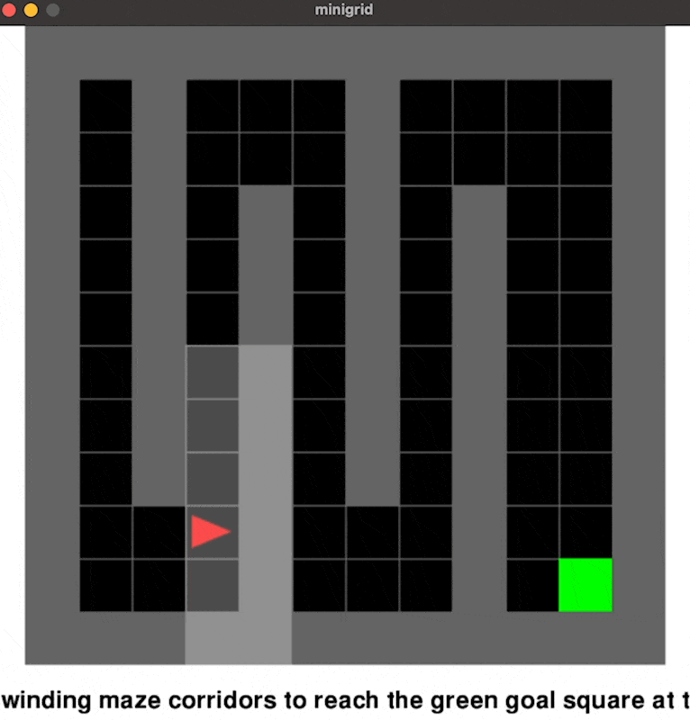

# Infinite Environment Generation using an Agent Harness

## Overview
This project is a model agnostic, agent harness that lets 
a language model generate 2d environments from natural-language
commands and navigate the environments it produces to accomplish objectives.

Environments are expressed as **scene specifications** (plain data), which an adapter translates 
into a runnable [MiniGrid](https://minigrid.farama.org/) environment. Minigrid is a 2d grid
world that consists of walls, lava, keys, locked doors, and goals. Because the spec is separate from the engine, 
the same generation and navigation pipeline can target other backends (e.g. a 3D MiniWorld adapter) by swapping only the adapter.

### Multi Door 


*Prompt: Create a maze with multiple doors, within the maze there should be multiple keys of matching colour to the doors, in order for the agent to reach the goal they must use the keys to go through subsequent doors and reach the goal.*

## Objects

An Environment can have the following:

| Object | Colour? | Notes |
|--------|---------|-------|
| `wall` | no | Impassable barrier. |
| `lava` | no | Impassable / hazardous — stepping on it ends the episode. |
| `goal` | no | The target tile the agent must reach. Exactly one per environment. |
| `key` | yes | Picked up and used to open a locked door of the matching colour. |
| `door` | yes | Passage between areas. Unlocked by default; `"locked": true` requires a matching-colour key. |
| `ball` | yes | A pickup item. |
| `box` | yes | A pickup item. |

Colours: `red`, `green`, `blue`, `purple`, `yellow`, `grey`.

The agent's actions are: turn left, turn right, move forward, pick up, drop, toggle
(open a door / box), and done. It can carry only one item at a time.

The agent has a facing direction (`dir`: 0=east, 1=south, 2=west, 3=north).
Movement is egocentric, so "forward" follows the facing and "left"/"right" only turn.

Doors are unlocked by default (similar style to MiniGrid) however it is up to the model to set "locked": true to create a locked door that requires a key to access.

## Quick start
```bash
pip install -r requirements.txt

# set an API key (.env file or environment variable, example env also given)
echo "ANTHROPIC_API_KEY=your_key_here" > .env

python start.py "a room with a key, a locked door, and a goal behind it."
```

You'll see generation attempts in the terminal along with the resulting spec, agent's plan, and a window that renders animating the agent traversing the environment.
The step by step trace and final success (true/false) are also included. Pressing enter in the terminal exits a render alongside quitting pygame.

## Example commands
```bash
python start.py "a twisting maze with a goal at the end"
python start.py "reach the goal while avoiding a patch of lava"
python start.py "a room where the agent must pick up the red key"
python start.py "make something difficult"
python start.py "create a maze with multiple coloured keys and matching doors that must be opened in sequence to reach the goal"
```
## Choosing models
The harness is provider-agnostic behind a small `LLMClient` interface. 
It currently works with Anthropic and Gemini backends and uses Fable 5 from Anthropic as a default.
To use Gemini instead, change one line in start.py:

```python
client = GeminiClient()
```
and set `GEMINI_API_KEY`

## Architecture
The pipeline for the harness is split into phases, each in its own group:

**Environment**
- `generator.py` - command → prompt → LLM → parsed spec → validate → repair loop
- `environment_validation.py` - structural checks + a flood-fill reachability check
- `engine.py` - a `SpecEnv` adapter that builds a MiniGrid environment from a spec
- `primitive_vocabulary.py` - the single source of truth for valid object types,
  colours, and required fields (read by both the validator and the adapter)

**Navigation**
- `navigator.py` - renders the environment for the model, gets an action plan,
  executes it against the engine
- `navigation_validation.py` - verifies the declared objective from engine state

**Shared**
- `client.py` - the `LLMClient` interface and its backends (Anthropic, Gemini,
  plus a scripted `TestingClient` for deterministic, no-API testing)
- `start.py` - end-to-end orchestration

The generator emits plain data and doesn't reference the engine. Only the adapter (`engine.py`) knows the engine,
so retargeting to a different backend (e.g. a 3D engine) is a new adapter not a codebase rewrite.

For a more in-depth discussion on design decisions, conclusions, and outcomes see [`DECISIONS.md`](DECISIONS.md).

## Limitations & observations
- Full observability: The agent plans the whole action list up front with no execution feedback, so it can commit to a plan that walks into a wall. Step-wise partially-observable navigation is the next step.

- Specification Gaming: When obstacles aren't forced onto the path agents can try to game ways to get around them without having to engage as closely.

- Nested objects (e.g. a key inside a box) aren't representable yet

## More Demos
### "Something Difficult to Navigate"

### Key and Door

### Key, Ball and Door

### Lava, Key and Door

### Winding Maze


## References
- MiniGrid / MiniWorld (Farama) - the 2D engine used, and its 3D sibling that
  the adapter design points toward.
- BabyAI - mission-conditioned gridworld task families, a reference for the
  objective-difficulty ladder

